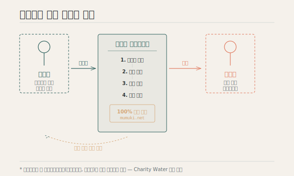
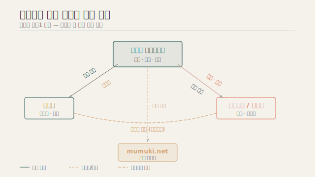
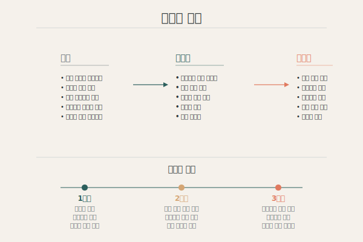

## 현행 기부 문화의 문제점

공공 복지는 완벽성과 평등성을 추구할 수밖에 없는 구조적 한계가 있습니다.
그 과정에서 발생하는 **복지 사각지대**는 민간의 기부와 후원으로 보완되어야 하지만,
현행 기부 문화에는 다음과 같은 문제가 존재합니다.

- 기부금의 사용처가 불투명하여 기부자의 신뢰가 저하됨
- 기부 단체의 운영비와 사업수행비의 경계가 모호함
- 기부자와 수혜자 사이의 거리가 멀어 지속적 관계가 형성되지 않음
- 수혜자의 실제 필요와 기부 내용이 불일치하는 경우가 발생함

## 다이렉트 기부 솔루션

무무키 파운데이션은 이러한 문제를 해결하기 위해 **다이렉트 기부 솔루션**을 제안합니다.

{fig-alt="기부자, 무무키 파운데이션, 수혜자 간의 다이렉트 기부 흐름 구조도"}

### 핵심 원칙

1. **직접 연결** — 기부자와 수혜자를 수평적 인간 관계로 직접 연결합니다
2. **전부 공개** — 모든 회계 내역(계좌·카드)을 홈페이지에 공개합니다
3. **비용 분리** — 운영비(일반관리비·모금비)는 기부금과 별도로 조달합니다
4. **매칭 추적** — 가상계좌 발급으로 기부금 입금부터 지출까지 추적 가능합니다

::: {.sidenote}
Charity Water의 운영 모델을 준용하여, 수혜자에게 직접 전달되는 사업수행비 외의 모든 비용은 별도의 모금으로 해결합니다.
:::

## 정보 흐름

{fig-alt="기부자, 무무키 파운데이션, 복지단체/수혜자, mumuki.net 간의 정보 흐름 다이어그램"}

무무키 파운데이션은 기부자와 수혜자 사이에서 **중개·매칭·공시** 역할을 수행하며, mumuki.net을 통해 모든 정보를 투명하게 공개합니다.

## 궁극적 목표

> 공공 복지의 사각지대를 발굴하여, 기부자와 수혜자의 수평적 인간 관계 속에서, 지속가능한 후원 모델을 발굴하는 것

이 목표를 위해 무무키 파운데이션은 단계적으로 사업을 확장해 나갑니다.

{fig-alt="문제에서 솔루션, 임팩트로 이어지는 무무키 파운데이션의 미션 다이어그램"}
