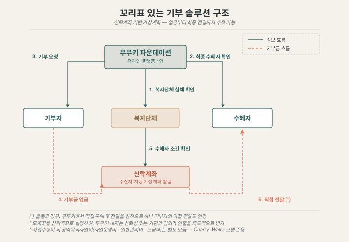
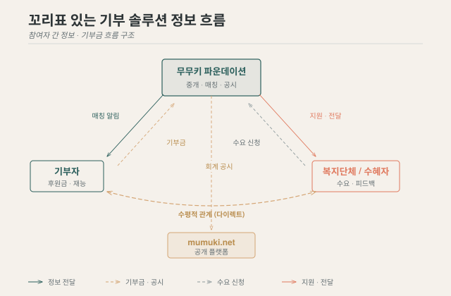
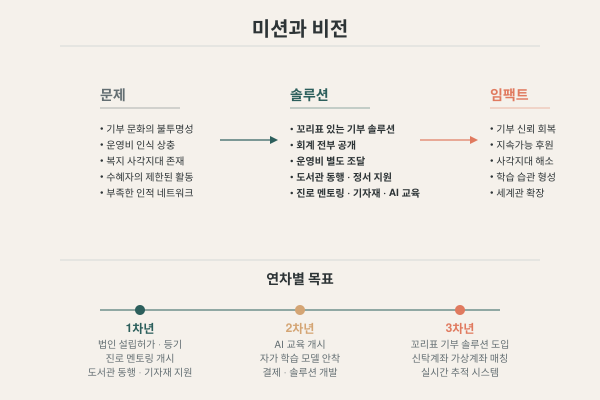

## 법인의 목적

> 본회는 서울지역의 취약계층 청소년을 위한 교육·문화 사업, 진로 멘토링 및 맞춤형 사례 관리를 수행하고, 지역사회의 연대를 통해 소외계층 청소년의 자립 지원과 사회적 통합에 기여함을 목적으로 한다.
>
> — 「사단법인 무무키 정관」 목적 조항 ([원문 PDF](/documents/mumuki-articles-summary-20260905.pdf))

무무키 파운데이션은 2026년 9월 5일 창립총회에서 정관을 채택하고, 위 목적을 달성하기 위한 네 가지 사업을 확정했습니다.

## 왜 지금인가 — 복지 공급의 비대칭

청소년 복지 영역에서 중앙부처(성평등가족부)와 지자체의 예산·제도는 꾸준히 확대되어 왔습니다.
그러나 확대된 영역은 대체로 **물질적·시설 중심의 지원**에 집중되어 있고, 그 결과 정신적 후원 영역에서 **공급의 비대칭**이 발생하고 있습니다.

- **청소년쉼터 등 지원시설** — 일시(33개소)·단기(66개소)·중장기(38개소) 쉼터, 자립지원관(13개소), 회복지원시설(18개소)로 촘촘해졌으나, 보호 기간이 끝난 뒤의 관계는 남지 않습니다
- **지자체 자립지원전담기관** — 지자체별로 예산과 정책이 상이하고, 물질적이고 산발적인 지원이 중심이어서 기회주의적 의타심을 기를 위험이 있습니다
- **이주배경청소년** — 성평등가족부·교육부·통일부·법무부가 각기 지원하고 있어 통합 조정이 필요하며, 특히 이탈주민 청소년은 실제와 주변 인식의 차이가 커 인격 형성과 적응에 어려움을 겪습니다

::: {.sidenote}
15~24세 체류 외국인은 2021년 3.3만 명에서 2025년 10.1만 명으로 늘었습니다(교육부 교육기본통계, 2025.08).
:::

민간 복지 시설은 정부의 지원 수준·영역과 **차별화된 새로운 복지 수요**를 발굴해야 하는 시점입니다.
무무키 파운데이션은 '함께 배우는 마음으로' 같이 공부하고, 정서적 안정감과 더불어 온전한 사회인으로서의 **'자활'의 방법**을 후원합니다.

## 기부 불신을 넘어서

기부금의 실질 분배 비용에 대한 **기부단체와 기부자의 인식 차이**, 두루뭉술한 회계 기준, 공개 자료의 불투명성이 기부 불신을 초래합니다.

| 관점 | 운영비로 보는 범위 |
|------|--------------------|
| 기부단체 | 일반관리비 + 모금비 (약 15%) |
| 기부자 | 사업운영비 + 일반관리비 + 모금비 |

같은 '공익목적 사업비'를 두고도 서로 다른 곳에 선을 긋습니다. 이 간극이 메워지지 않으면 신뢰는 쌓이지 않습니다.
따라서 **기부자에 대한 사업결정권 부여**, **목적별 구분 모금과 완전한 공개**, **투명하고 효율적인 모금·지출 솔루션**이 필요합니다.

::: {.sidenote}
참고: 『기부불신』(마음연결, 2024.05). 기부단체의 운영성과표는 1365기부포털(nanumkorea.go.kr)에서 확인할 수 있습니다. 이 절의 분석은 [창립총회 발표자료](/documents/mumuki-founding-assembly-20260905.pdf)에 근거합니다.
:::

### 주어진 조건 속에서의 더 나은 대안

- **Charity: Water** — 개도국 주민 식수 제공 사업. 기부금 100%가 사업수행비로 쓰입니다. 운영비와 사업수행비를 구분하여 모금하고, GPS·IoT 등 첨단기술로 결과를 증명합니다
- **네이버 코드** — 사업 개발 과정을 블로그 형식으로 고객과 공유합니다. 후원 사업의 런칭 배경과 결과를 소통하는 방식을 참고합니다
- **민간 영역의 개척** — 깔창 생리대 사태(2016) 이후 민간단체의 활동이 공공 영역으로 편입된 사례처럼, 민간은 절실하고 새로운 복지 영역을 지속적으로 개척해야 합니다

## 꼬리표 있는 기부 솔루션

무무키 파운데이션은 이러한 문제를 해결하기 위해 **꼬리표 있는 기부 솔루션**(다이렉트 기부 솔루션)을 제안합니다.

{fig-alt="기부자, 무무키 파운데이션, 복지단체, 신탁계좌, 수혜자를 잇는 꼬리표 있는 기부 솔루션 구조도"}

### 핵심 원칙

1. **직접 연결** — 기부자와 수혜자를 수평적 인간 관계로 직접 연결합니다
2. **자금 추적** — 신뢰성 있는 기관 명의의 모계좌를 통한 가상계좌 기반 기부로, 자금 추적이 가능한 형태로 100% 직접 지원합니다
3. **임의 인출 방지** — 모계좌를 **신탁계좌**로 설정하여, 무무키 파운데이션조차 임의로 인출할 수 없도록 제도적으로 차단합니다
4. **전부 공개** — 모든 회계 내역(계좌·카드)을 홈페이지에 공개합니다
5. **비용 분리** — 운영비(일반관리비·모금비)는 기부금과 별도로 조달합니다

::: {.sidenote}
Charity: Water의 운영 모델을 준용하여, 수혜자에게 직접 전달되는 사업수행비 외의 모든 비용은 별도의 모금으로 해결합니다.
:::

## 정보 흐름

{fig-alt="기부자, 무무키 파운데이션, 복지단체/수혜자, mumuki.net 간의 정보 흐름 다이어그램"}

무무키 파운데이션은 기부자와 수혜자 사이에서 **중개·매칭·공시** 역할을 수행하며, mumuki.net을 통해 모든 정보를 투명하게 공개합니다.

## 궁극적 목표

> 공공 복지의 사각지대를 발굴하여, 기부자와 수혜자의 수평적 인간 관계 속에서, 지속가능한 후원 모델을 발굴하는 것

이 목표를 위해 무무키 파운데이션은 단계적으로 사업을 확장해 나갑니다.

{fig-alt="문제에서 솔루션, 임팩트로 이어지는 무무키 파운데이션의 미션 다이어그램"}
