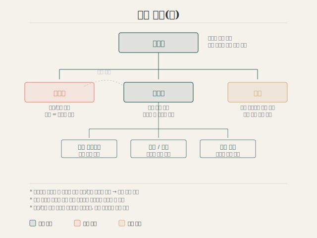

## 조직도

{fig-alt="이사회, 사무국, 회장단, 감사로 구성된 무무키 파운데이션 조직도"}

## 이사회

**전문직 중심**으로 구성하며, 교육 기부자 중심의 각계 주요 인사들로 이루어집니다.

- 교육 기부자와는 별도의 개념으로 운영
- 행정·법적 책임을 부담하므로, 교육 기부자의 의사를 존중
- 무파의 주요 의사결정 및 감독 역할 수행

## 사무국

**실질 운영의 중심**으로, 김두선 인천계양지역자활센터 전 센터장이 주도합니다.

- 발굴 프로젝트 기획 및 관리
- 조직 운영을 위한 비상근 인력 채용 지원 (예산 범위 내)
- 개별 분과의 계획 수립 및 집행

## 회장단

**기부·후원 발굴**을 위한 조직입니다.

- 대표는 이사장이 겸직하여 행정·법적 책임 부담을 최소화
- 이사회 및 사무국 대상 자료·정보 열람권 부여
- 상호 견제를 통한 투명성 확보

## 감사

- 법적 공시의무 요건과 무관하게, **외부 회계감사보고서를 연차 발행**
- 독립적 감사 기능으로 조직 운영의 신뢰성 보장

::: {.sidenote}
향후 구성은 당사자 의사 등을 확인하는 과정에서 변동될 수 있습니다.
:::
