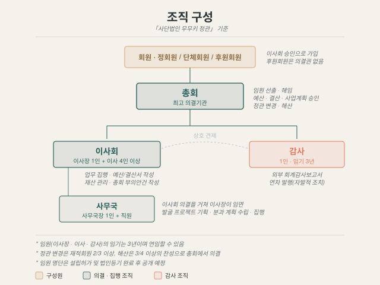

## 법인 개요

| 항목 | 내용 |
|------|------|
| 명칭 | 사단법인 무무키 (mumuki foundation) — 약칭 '무파' |
| 소재지 | 서울특별시 강남구 학동로 45길 7, 503호 |
| 정관 | 법무부·서울시 「표준정관」 기반, 총 45조 — [주요내용 PDF](/documents/mumuki-articles-summary-20260905.pdf) |
| 창립총회 | 2026년 9월 5일, 발기인 10인 전원 기명날인 |
| 시행일 | 주무관청의 허가를 받아 법원에 등기를 한 날부터 시행 |

## 조직도

{fig-alt="총회, 이사회, 감사, 사무국으로 구성된 사단법인 무무키 조직도"}

## 총회

총회는 본회의 **최고 의결기관**이며 회원으로 구성합니다.

- 정기총회와 임시총회로 구분하며, 이사장이 소집합니다
- 정기총회는 매 회계연도 개시 2개월 이내에 개최합니다
- 소집 시 이사장이 회의안건·일시·장소를 명기하여 회의 개시 **7일 전까지** 각 회원에게 통지합니다

### 총회 의결 사항

- 임원의 선출 및 해임
- 본회의 해산 및 정관 변경
- 법인 재산의 처분·취득 및 자금 차입
- 예산 및 결산의 승인
- 사업계획의 승인
- 기타 중요사항 및 이사회에서 부의한 사항

## 이사회

| 임원 | 정수 | 임기 |
|------|------|------|
| 이사장 | 1명 | 3년 (연임 가능) |
| 이사 | 4명 이상 | 3년 (연임 가능) |
| 감사 | 1명 | 3년 (연임 가능) |

임원은 **총회에서 선출**합니다. 임원이 본회의 목적에 위배되는 행위, 임원 간 분쟁·회계부정 또는 현저한 부당행위, 본회의 업무를 방해하는 행위를 한 때에는 총회의 의결을 거쳐 해임할 수 있습니다.

### 이사회 심의·의결 사항

- 업무 집행에 관한 사항
- 사업계획의 운영에 관한 사항
- 예산·결산서의 작성에 관한 사항
- 정관 변경에 관한 사항
- 재산 관리에 관한 사항
- 총회에 부의할 안건의 작성
- 총회에서 위임받은 사항

## 감사

- 정관에 따라 감사 1인을 두며, 총회에서 선출합니다
- 이에 더해, **법적 공시의무 요건과 무관하게 외부 회계감사보고서를 연차 발행**합니다 (자발적 조치)
- 독립적 감사 기능으로 조직 운영의 신뢰성을 보장합니다

## 사무국

이사장의 지시를 받아 본회의 사무를 처리하기 위하여 사무국을 둡니다.

- 사무국에 **사무국장 1인**과 필요한 직원을 둘 수 있습니다
- 사무국장은 **이사회의 의결을 거쳐 이사장이 임면**합니다
- 발굴 프로젝트 기획·관리, 개별 분과의 계획 수립 및 집행, 비상근 인력 채용 지원을 담당합니다

## 회원 제도

회원은 본회의 설립 취지에 찬동하고 소정의 입회신청서를 제출하여 **이사회의 승인**을 얻은 개인 또는 단체입니다.

| 구분 | 선거권·피선거권·의결권 | 사업·활동 참여 | 자료 제공 | 의무 |
|------|:---:|:---:|:---:|------|
| **정회원** | ○ | ○ | ○ | 회비 납부 |
| **단체회원** | ○ | ○ | ○ | 회비 납부 |
| **후원회원** | ✕ | ○ | ○ | [후원금(제 부담금) 납부]{.nowrap} |

모든 회원은 본회의 정관 및 제 규약을 준수하고, 총회 및 이사회의 결의사항을 이행할 의무를 집니다.
회원은 이사장에게 탈퇴서를 제출함으로써 **자유롭게 탈퇴**할 수 있습니다.

[회원 가입 및 후원 안내 →](../participate/donate.qmd){.btn-outline}

## 정관 변경 및 해산

- **정관 변경** — 총회에서 재적회원 **3분의 2 이상**의 찬성으로 의결하고, 주무관청의 허가를 받아야 합니다
- **해산** — 총회에서 재적회원 **4분의 3 이상**의 찬성으로 의결하고, 주무관청에 신고해야 합니다
- **잔여재산** — 해산 시 잔여재산은 총회의 의결을 거쳐 국가, 지방자치단체 또는 본회와 유사한 목적을 가진 다른 비영리법인에 귀속합니다

::: {.sidenote}
본 페이지는 창립총회(2026.9.5)에 제출된 「정관 주요내용」을 근거로 작성되었습니다. [원문 PDF](/documents/mumuki-articles-summary-20260905.pdf)를 함께 확인하실 수 있습니다. 임원 명단은 설립허가 및 법인등기 완료 후 공개할 예정입니다.
:::
