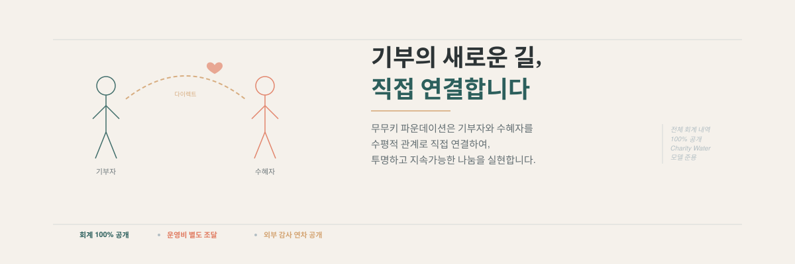
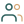
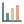

::: {.hero-section}
::: {.hero-inner}
::: {.hero-content}

[기부의 새로운 길,]{.hero-title}[직접 연결합니다]{.hero-title .hero-accent}

[사단법인 무무키는 서울지역 **취약계층 청소년**의 학습·진로·자립을 돕습니다. **꼬리표 있는 기부 솔루션**으로 기부자와 수혜자를 수평적 관계 속에서 직접 연결하고, 모든 회계 내역은 **100% 공개**합니다.]{.hero-subtitle}

[도서관 동행 · 진로 멘토링 · 학습 기자재 · AI 교육]{.hero-tagline}

::: {.hero-actions}
[무무키가 하는 일](#무무키가-하는-일){.btn-teal}
[설립 취지](about/mission.qmd){.btn-outline}
:::

:::

::: {.hero-visual}
{fig-alt="기부자와 수혜자를 직접 연결하는 꼬리표 있는 기부 솔루션 개념도" .hero-image}
:::

:::
:::

::: {.section-programs}
::: {.container-narrow}

## 무무키가 하는 일 {.section-heading}

::: {.program-grid}

::: {.program-card}
::: {.card-icon}
{fig-alt="도서관 아이콘" width="48"}
:::

### 도서관 동행 및 정서 지원

독서 지도사·대학생 자원봉사자와 청소년을 1:2로 매칭합니다. 주 1회 도서관 동행으로 스스로 공부하는 습관을 기르고, 월 1회 문화체험으로 정서적 유대를 쌓습니다.

[자세히 보기 →](programs/library.qmd){.card-link}
:::

::: {.program-card}
::: {.card-icon}
{fig-alt="멘토링 아이콘" width="48"}
:::

### 진로 상담 · 멘토링

IT·예술·공공 등 다양한 직업군의 멘토단을 구축하여 월 2회 1:1 진로 멘토링을 진행합니다. 적성검사와 커리어 로드맵 워크숍을 함께 운영합니다.

[자세히 보기 →](programs/career.qmd){.card-link}
:::

::: {.program-card}
::: {.card-icon}
{fig-alt="학습 기자재 아이콘" width="48"}
:::

### 학습 기자재 지원

태블릿 PC, 인터넷 강의 수강권, 독서 소프트웨어를 지원합니다. 고장·노후 기자재의 수리비까지 지원하여 평등한 교육 환경을 만듭니다.

[자세히 보기 →](programs/equipment.qmd){.card-link}
:::

::: {.program-card}
::: {.card-icon}
{fig-alt="AI 교육 아이콘" width="48"}
:::

### AI 교육 지원

Python·스크래치 기초부터 생성형 AI 활용 프로젝트, 오픈소스 하드웨어 실습까지. 기술 격차를 해소하고 미래 IT 인재로 성장할 발판을 제공합니다.

[자세히 보기 →](programs/ai-education.qmd){.card-link}
:::

:::

::: {.transparency-note}
**꼬리표 있는 기부 솔루션** — 위 네 가지 사업은 신탁계좌 기반의 가상계좌로 운영됩니다. 기부금에 '꼬리표'가 붙어 입금부터 최종 전달까지 추적할 수 있습니다. [자세히 보기 →](programs/direct-donation.qmd)
:::

:::
:::

::: {.section-transparency}
::: {.container-narrow}

## 투명한 운영 {.section-heading}

::: {.stats-grid}

::: {.stat-item}
[100%]{.stat-number}
[회계 내역 공개]{.stat-label}
:::

::: {.stat-item}
[별도 조달]{.stat-number-sm}
[운영비는 기부금과 분리]{.stat-label}
:::

::: {.stat-item}
[매년 3월]{.stat-number-sm}
[기부금 모금·활용실적 공시]{.stat-label}
:::

:::

::: {.transparency-note}
무무키 명의 계좌·카드 내역은 홈페이지에 전체 공개합니다. 기부자·수혜자명은 비식별화 처리합니다. 운영비(일반관리비·모금비)는 사업수행비와 별도로 조달하여, 기부금 전액이 수혜자에게 전달되도록 합니다. 정관에 따라 연간 기부금 모금액 및 활용실적은 매년 3월말까지 홈페이지와 국세청 홈택스에 공개합니다. — *Charity Water 모델 준용*
:::

[투명한 운영 자세히 보기 →](transparency/index.qmd){.btn-outline}

:::
:::

::: {.section-cta}
::: {.container-narrow}

[함께 만드는 변화]{.cta-title}

[작은 관심이 한 아이의 세계를 바꿉니다.]{.cta-subtitle}

[후원하기](participate/donate.qmd){.btn-donate .btn-lg}
[봉사·멘토링 참여](participate/volunteer.qmd){.btn-outline .btn-lg}

:::
:::
