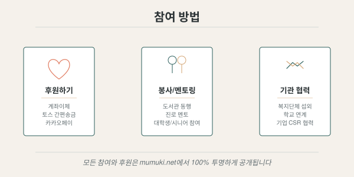

## 후원하기

무무키 파운데이션에 보내주시는 모든 후원금은 **100% 투명하게 공개**됩니다.
기부금 전액은 수혜자에게 직접 전달되며, 운영비는 별도로 조달합니다.

{fig-alt="후원하기, 봉사·멘토링, 기관 협력의 세 가지 참여 방법 안내"}

::: {.callout-note}
## 현재 상태 (2026년 9월)
2026년 9월 5일 창립총회에서 정관과 사업계획이 승인되었습니다. 앞으로 **주무관청 설립허가와 법인등기 절차**를 밟게 되며, 법인 명의 계좌는 등기 완료 후 개설됩니다.
그 전까지는 아래 이메일로 후원 의사를 남겨주시면, 계좌 개설 즉시 안내드리겠습니다.
:::

---

## 회원으로 함께하기

정관에 따라 회원은 세 가지로 구분됩니다. 회원 가입은 **입회신청서 제출 후 이사회 승인**으로 이루어집니다.

| 구분 | 대상 | 의무 | 총회 의결권 |
|------|------|------|:---:|
| **정회원** | 설립 취지에 찬동하는 개인 | 회비 납부 | ○ |
| **단체회원** | 설립 취지에 찬동하는 단체 | 회비 납부 | ○ |
| **후원회원** | 재정적 후원을 원하는 개인·단체 | 후원금 납부 | ✕ |

- 정회원·단체회원은 임원의 선거권·피선거권과 총회 의결권을 가지며, 모든 사업과 활동에 참여하고 의견을 제출할 수 있습니다
- 후원회원은 의결권은 없으나, 모든 사업과 활동에 참여하고 각종 자료를 제공받을 수 있습니다
- 회원은 이사장에게 탈퇴서를 제출함으로써 **자유롭게 탈퇴**할 수 있습니다

**가입 문의**: mumuki.jaedan@gmail.com

---

## 계좌이체

| 항목 | 내용 |
|------|------|
| 은행 | (법인등기 완료 후 안내 예정) |
| 계좌번호 | (법인등기 완료 후 안내 예정) |
| 예금주 | 사단법인 무무키 |

## 간편 송금

- **토스**: (법인등기 완료 후 toss.me/mumuki 개설 예정)
- **카카오페이**: (법인등기 완료 후 QR코드 안내 예정)

---

## 후원금은 이렇게 쓰입니다

창립총회에서 승인된 1차년도 사업 예산입니다.

| 사업 | 주요 지출 | 1차년 예산 |
|------|-----------|-----------:|
| [도서관 동행 및 정서 지원](../programs/library.qmd) | 문화체험 활동비, 식사비(직불카드 직접 결제), 독서 지도 활동비 | 900,000원 |
| [진로 상담 · 멘토링](../programs/career.qmd) | 적성검사(MBTI·Holland) 비용, 워크숍 운영비, 멘토링 이동·식사비 | 2,100,000원 |
| [학습 기자재 지원](../programs/equipment.qmd) | 태블릿 PC, 인터넷 강의 수강권, 소프트웨어 라이선스, 수리비 | 3,500,000원 |
| **합계** | | **6,500,000원** |

[AI 교육 지원사업](../programs/ai-education.qmd)(2,500,000원)은 2년차부터 시행 예정입니다.

::: {.sidenote}
지출 내역은 [회계 공시](../transparency/finance.qmd) 페이지에 전액 공개됩니다. 물품 지원의 경우 무무키에서 직접 구매하므로 구매 영수증이 그대로 공시 자료가 됩니다.
:::

---

## 생활 속 기부 — 경조금 다시 생각하기

큰 결심 없이도 시작할 수 있는 기부가 있습니다.

- **경조금을 받을 경우** — 별도의 기부처 계좌를 미리 기재하기보다, '전액 기부'를 전제로 받은 뒤 여러 선택지를 함께 살펴보고 기부하기를 권합니다
- **경조금을 줄 경우** — 기부처로 먼저 기부한 뒤, 장문의 인사를 남기는 방법을 고려할 수 있습니다

형식적으로 오가던 봉투가, 서로의 마음을 확인하는 계기가 됩니다.

---

## 기부금 영수증

연말정산 기부금 영수증이 필요하신 분은 아래 정보를 알려주시면 발급해 드립니다.

- 성명, 주민등록번호(앞 6자리), 연락처
- 신청 방법: 이메일 (mumuki.jaedan@gmail.com)

::: {.callout-tip}
## 안내
기부금 영수증은 **법인등기 및 기부금단체 지정 후** 발급이 가능합니다.
국세청 홈택스 연말정산 간소화 서비스에도 반영될 예정입니다.
:::
