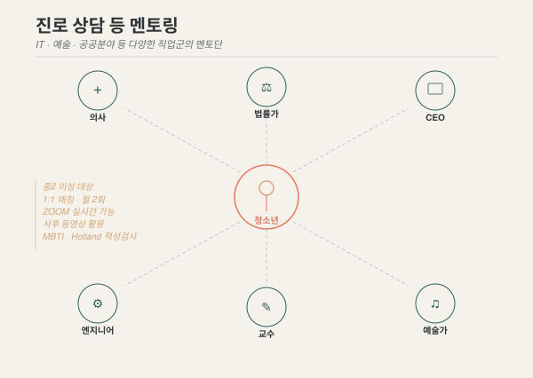

## 목적

진로 탐색의 기회가 부족한 서울지역의 취약계층 청소년들에게 **다양한 직업군의 멘토**를 연결해 줌으로써, **자아존중감을 향상**하고 **주도적인 미래 설계**를 지원합니다.

{fig-alt="청소년을 중심으로 의사, 법률가, CEO, 엔지니어, 교수, 예술가 등 다양한 멘토가 연결되는 허브&스포크 다이어그램"}

## 왜 이 프로그램이 필요한가

시설 및 학교 안의 청소년들은 극히 제한된 환경에서 활동합니다.

- **안전 우려**로 인한 제한된 외부 활동
- **부모·친인척 상당수 부재**로 인한 부족한 인적 네트워크
- **사회성 부족** 및 미래에 대한 꿈과 희망이 매우 편협한 경우가 많음

특히 사전 활동에서 만난 청소년들은 배움에 대한 자세는 적극적이었으나, 다양한 경험의 부족으로 막연한 동경에 머무는 경우가 많았습니다.
생활과 학습을 병행해야 하는 현실 속에서 **구체적이고 현실적인 진로 상담**이 무엇보다 중요합니다.

## 사업 내용

| 활동 | 내용 | 주기 |
|------|------|------|
| **멘토단 구축** | 정회원 및 외부 전문가(IT, 예술, 공공분야 등) 멘토단 구성 | 상시 |
| **1:1 진로 매칭 멘토링** | 청소년과 온·오프라인 1:1 멘토링 | 월 2회 |
| **적성검사** | MBTI, Holland 검사 실시 | 사업계획에 따름 |
| **커리어 로드맵 워크숍** | 검사 결과를 바탕으로 커리어 로드맵 작성 | 사업계획에 따름 |

**소요예산**: 약 2,100,000원 (1년차 기준)

## 운영 방식

| 항목 | 내용 |
|------|------|
| 대상 | 최소 중2 이상 |
| 형태 | 온라인(ZOOM) 및 오프라인 1:1 멘토링, 직장 방문, 오프라인 강의 |
| 멘토 구성 | 전문직, 회사 C-Level, 공무원, 예술가, 엔지니어 등 |
| 식사 | 필요 시 식사 제공 — 무무키 직불카드 결제 |
| 기록 | 사후 동영상 활용 가능 |
| 보안 | 직장 방문 시 보안·출입 요건 사전 확인 필요 |

### 멘토 참여 방법

1. 무무키 회원 및 주변 소개를 통한 멘토 섭외
2. 도서관 동행 모델과 연계하여 자연스럽게 소개
3. 사무국과 연간 멘토링 일정 수립
4. 청소년과 1:1 매칭 후 월 2회 멘토링 진행

::: {.sidenote}
실시간 ZOOM 활용 및 사후 동영상 활용으로, 물리적 거리와 시간의 제약을 최소화합니다. 멘토링은 동정이 아닌 동등한 인격체 간의 대화를 전제로 합니다.
:::

[멘토 참여 신청 →](../participate/volunteer.qmd){.btn-outline}
