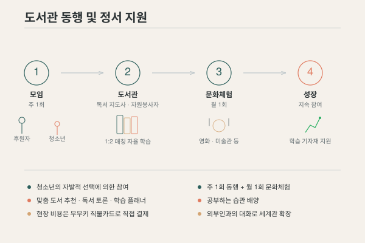

## 목적

저소득층, 다문화 가정 등 취약계층 청소년들이 방과 후 **안정적인 공간(도서관)에서 스스로 공부할 수 있는 습관**을 기르도록 돕고, 정서적 유대감을 제공하여 **학업 중단을 예방**합니다.

{fig-alt="주 1회 도서관 동행, 1:2 매칭 자율 학습, 월 1회 문화체험, 성장으로 이어지는 프로그램 4단계 흐름도"}

## 사업 내용

| 활동 | 내용 | 주기 |
|------|------|------|
| **매칭** | 전문 독서 지도사 및 대학생 자원봉사자와 청소년 매칭 (**1:2** 구성) | 상시 |
| **도서관 동행** | 맞춤형 도서 추천, 독서 토론, 일일 학습 플래너 작성 지도 | 주 1회 |
| **문화체험** | 영화 관람, 미술관 방문 등 정서 지원 활동 | 월 1회 |

**소요예산**: 약 900,000원 (1년차 기준)

## 기대 효과

- **자율 학습 습관 배양** — 공부하는 습관을 자연스럽게 형성
- **세계관 확장** — 시설 외부인과의 대화를 통해 사회·세계에 대한 시야를 넓힘
- **정서적 안정** — '키다리 아저씨·아주머니'와의 지속적 시간 공유로 상호 신뢰 구축
- **학업 중단 예방** — 정서적 유대가 학업 지속의 버팀목이 됨

## 동행 시 지켜야 할 원칙

3년간의 사전 활동에서 얻은 교훈을 원칙으로 정리했습니다.

::: {.callout-important}
## 동행 수칙

1. **사회에서 만난 동등한 인격체로 대우합니다** — 동정하지 않습니다
2. **프라이버시를 존중합니다** — 인증샷에 유의하고, 사적인 질문은 자제합니다
3. **정시에 도서관에 도착했는지만 확인합니다** — 휴식·식사 시간을 약속하되, 같은 열람실을 권장합니다
4. **최소 월 1회, 최소 1년 이상 약속합니다** — 기회주의적 상황으로 만들지 않습니다
5. **먹는 것만큼은 선택지를 주고 맛있는 것으로 사 줍니다** — 의도적으로 현찰·직불카드로 결제합니다
6. **후원자는 조연, 청소년이 주연입니다**
:::

## 사전 활동에서 확인한 것

법인 설립에 앞서 개인 자격으로 도서관 동행을 이어왔습니다.
이 과정에서 **자발적 참여**, **개방적 운영**, **개별적 관계**가 프로그램 지속의 핵심 조건임을 확인했습니다. 현재는 남북하나재단 추천 학교와 연계하여 탈북 청년과의 동행을 지속하고 있습니다.

## 참여 방법

| 대상 | 참여 형태 |
|------|-----------|
| 전문 독서 지도사 | 도서 추천, 독서 토론, 학습 플래너 지도 |
| 대학생 자원봉사자 | 도서관 동행, 자율 학습 지원, 대화 |
| 정회원·후원회원 | 문화체험 활동 동행, 식사비 후원 |

::: {.sidenote}
청소년의 참여는 자발적 선택에 의합니다. 지속가능한 지원을 위해 인근 대학교 및 시니어 단체 섭외를 병행합니다. 식사비 등 현장 비용은 무무키 명의 직불카드로 직접 결제하여 전액 공개합니다.
:::

[봉사 참여 신청 →](../participate/volunteer.qmd){.btn-outline}
