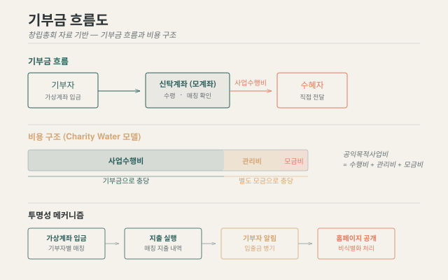

## 운영 원칙

무무키 파운데이션은 **전부 공개 원칙**을 기반으로 운영됩니다.

### 1. 정관에 근거한 회계 공개

「사단법인 무무키 정관」([원문 PDF](/documents/mumuki-articles-summary-20260905.pdf))은 회계 공개를 다음과 같이 규정합니다.

> - 본회의 예산과 결산은 이사회가 따로 정하는 방법에 따라 공개한다.
> - 연간 기부금 모금액 및 활용실적은 **매년 3월말까지 인터넷 홈페이지 및 국세청 홈택스**를 통해 공개한다.

무무키 파운데이션은 여기서 한 걸음 더 나아갑니다.

- 무무키 명의 **계좌·카드 내역**은 홈페이지에 전체 공개
- 기부자·수혜자명 등은 일부 가림(비식별화)으로 개인정보 보호
- 가상계좌 발급에 대한 **매칭 지출 내역**도 병기하여 기부자에게 통지
- 사업계획에 동일 계정 및 매칭된 입·출금 표기로 기부자의 혼돈 방지

### 2. 비용 분리 (Charity: Water 모델)

{fig-alt="기부금 흐름도와 사업수행비, 일반관리비, 모금비의 비용 구조 다이어그램"}

수혜자에게 직접 전달되는 **사업수행비** 외의 모든 비용은 별도의 모금으로 해결합니다.

- **공익목적사업비** = 사업수행비 + 사업운영비 + 일반관리비 + 모금비
- 기부단체가 '운영비'라 부르는 범위와 기부자가 생각하는 범위가 다르다는 점을 인정하고, **기부자의 기준**을 따릅니다
- 기부자의 기부금은 **전액** 수혜자에게 전달

### 3. 임의 인출의 제도적 차단

꼬리표 있는 기부 솔루션의 모계좌는 **신탁계좌**로 설정합니다.
무무키 파운데이션 내지는 신뢰성 있는 기관의 **임의적 인출을 제도적으로 방지**하기 위한 장치입니다.
공개는 사후 감시이지만, 신탁계좌는 사전 차단입니다.

[꼬리표 있는 기부 솔루션 자세히 보기 →](../programs/direct-donation.qmd){.card-link}

### 4. 외부 감사

- 정관에 따라 **감사 1인**을 총회에서 선출합니다
- 이에 더해, 법적 공시의무 요건과 무관하게 **외부 회계감사보고서를 연차 발행**합니다 (자발적 조치)
- 독립적 감사를 통한 객관적 검증

### 5. 거버넌스

- **총회**(최고 의결기관) — 예산·결산 및 사업계획 승인, 임원 선출·해임
- **이사회** — 이사장 1인 + 이사 4인 이상, 업무 집행 및 예산·결산서 작성
- **감사** — 1인, 독립적 감사
- **사무국** — 사무국장 1인, 이사회 의결을 거쳐 이사장이 임면
- 회원(정회원·단체회원)은 총회에서 의결권을 행사하여 집행부를 견제합니다

[조직 구성 자세히 보기 →](../about/organization.qmd){.card-link}

---

[회계 공시 보기 →](finance.qmd){.btn-outline} &nbsp;
[감사보고서 →](audit.qmd){.btn-outline} &nbsp;
[공개 자료 →](documents.qmd){.btn-outline}
